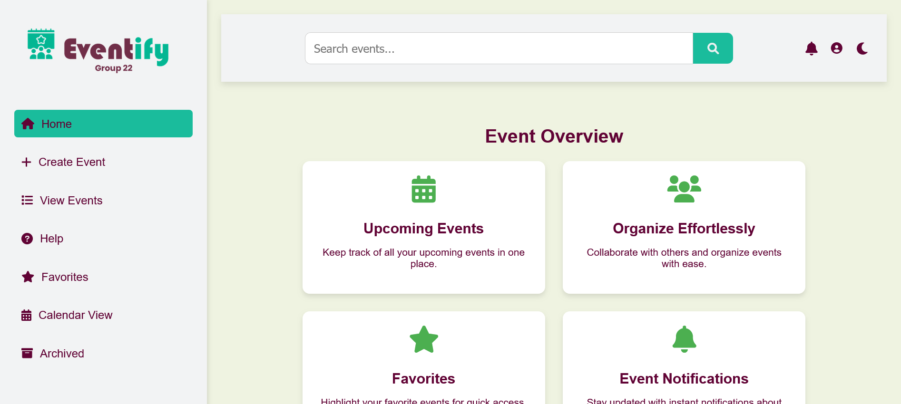
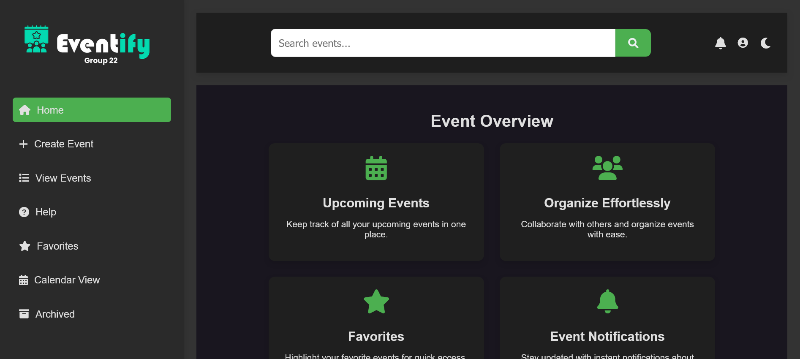
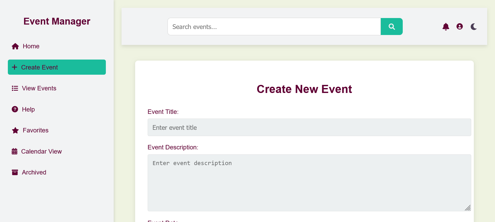
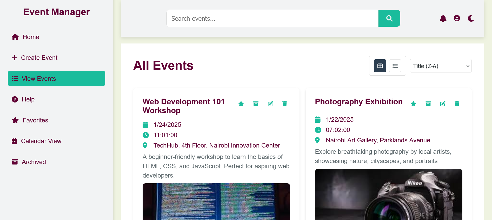
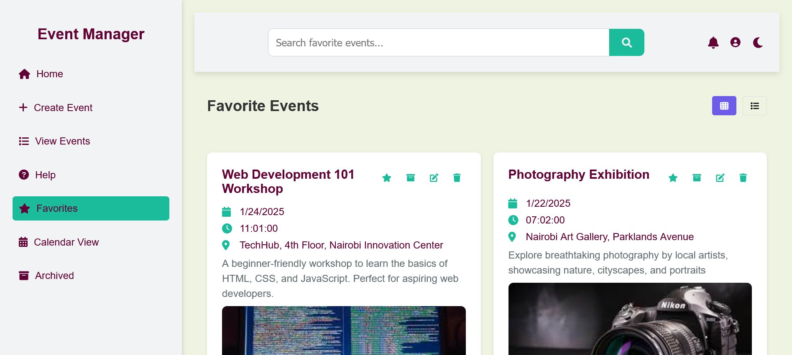
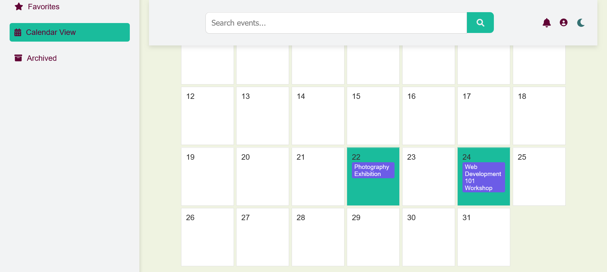
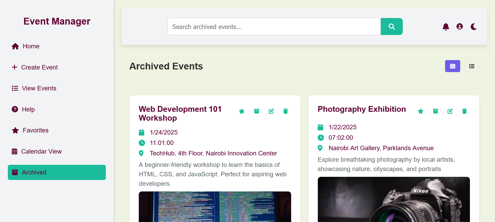

# 🎉 Eventify - Modern Event Management System

## Live Demo

[](https://event-manager-p021.onrender.com/)

### [](https://event-manager-p021.onrender.com/)


**_A streamlined event management solution built with vanilla JavaScript and Node.js_**

## 📋 Table of Contents

- [Overview](#overview)
- [Project Motivation](#project-motivation)
- [Challenges and Learnings](#challenges-and-learnings)
- [Features](#features)
- [Technology Stack](#technology-stack)
- [Development Process](#development-process)
- [Milestones and Achievements](#milestones-and-achievements)
- [Getting Started](#getting-started)
- [Database Setup](#database-setup)
- [API Documentation](#api-documentation)
- [Usage Examples](#usage-examples)
- [Performance Optimization](#performance-optimization)
- [Test Cases](#test-cases)
- [Group Members](#group-members)
- [Acknowledgments](#acknowledgments)
- [Get in Touch](#Get in Touch)

## 🌟 Overview

Eventify transforms event management with a modern, intuitive interface designed for seamless event organization. Built as part of the S-Hook Hackathon challenge, it demonstrates full-stack development capabilities using pure HTML, CSS, JavaScript node js, express and mysql.

## 🌟 Motivation  
Eventify was developed to simplify event management for both organizers and attendees, addressing challenges like accessibility, organization, and communication during the S-Hook Hackathon.

## 🧠 Challenges and Learnings  
- **Challenges**: Implementing responsive design, optimizing database queries, and managing state in vanilla JavaScript.  
- **Learnings**: Improved knowledge of MySQL indexing, RESTful API design, and enhancing user experiences with pure CSS.

## ✨ Features

### Core Features

- **Event Management**

  - Create and edit events with rich details
  - Upload event images
  - Set attendee limits
  - Add locations and time details

- **Smart Organization**

  - Favorite events system
  - Archive functionality
  - Calendar view
  - Grid/List view toggle

- **Advanced UI/UX**
  - Dark/Light mode
  - Responsive design
  - Real-time search
  - Custom animations
  - Date-based sorting

## 🛠 Technology Stack

- **Frontend**

  - HTML5
  - CSS3 (Pure CSS animations)
  - Vanilla JavaScript
  - FontAwesome icons

- **Backend**
  - Node.js
  - Express.js
  - MySQL
  - RESTful API

## Project Structure 📁

```
event-manager/
├── public/
│   ├── index.html
│   ├── add-event.html
│   └── view-event.html
    └── help.html
    └── favorites.html
    └── calendar.html
    └── archive.html
    └── styles.css
    └── main.js
├── server.js
├── event_manager.sql
├── package.json
└── README.md
```
 ## ⏳ Development Process  
- **Day 1**: Ideation and initial setup.  
- **Day 2**: Database schema and basic backend functionalities.  
- **Day 3**: Frontend development and API integration.  
- **Day 4**: Testing, documentation and deployment.
  
## 🎯 Milestones  

- Successfully deployed on Render within.  
- Integrated a dark mode toggle with pure JavaScript for enhanced user experience.  
- Built and tested RESTful API endpoints, ensuring seamless communication between frontend and backend.  
- Implemented calendar view with dynamic event sorting, improving event visualization.  
- Designed and developed responsive UI using pure CSS, providing a mobile-friendly interface.  
- Established MySQL database and optimized it with proper indexing for faster queries.  
- Integrated event image uploads.  
- Developed user favorites and archive features, enhancing event management.     
- Implemented error handling across the app, providing clear user feedback for any issues.   
- Created comprehensive documentation, including API references and deployment guidelines.


## Getting Started 🚀

### Prerequisites

- Node.js v14+ required
  `node --version`
- MySQL v8.0+ required
  `mysql --version`
- Git

### Installation Steps

1. Clone the repository:

   ```bash
   git clone https://github.com/BrianKachumba/Group22.git
   cd Group22
   ```

2. Install dependencies:

   ```bash
   npm install
   ```

3. Set up the database:

   ```bash
   mysql -u root -p < db.sql
   ```

4. Configure environment variables:

   ```env
   DB_HOST=<YOUR_DB_HOST>
   DB_PORT=<YOUR_DB_PORT>
   DB_NAME=<YOUR_DB_NAME>
   DB_USER=<YOUR_USERNAME>
   DB_PASSWORD=<YOUR_PASSWORD>
   PORT=3000
   ```

   Create a `.env` file in the root directory and add the above configuration. 

5. Start the server:

   ```bash
   node server.js
   ```

6. Access the application at `http://localhost:3000`

   
## 🔒 Security Practices  
- Stored passwords securely using bcrypt.  
- Validated all user inputs to prevent SQL injection.  
- Enabled CORS with strict policies for secure API usage. 

## 🔧 Troubleshooting Guide  
- **Issue**: "Database connection failed."  
  - **Solution**: Check your `.env` file for correct credentials and ensure MySQL is running.  
- **Issue**: "Styles not loading properly."  
  - **Solution**: Clear your browser cache or ensure all static files are served correctly.  
---


## API Endpoints 🛣️

- `GET /api/events` - Get all events
- `GET /api/events/:id` - Get specific event
- `POST /add-event` - Create new event
- `DELETE /api/events/:id` - Delete event


## 📊 Database Setup

### MySQL Setup Commands

```sql
CREATE TABLE events (
  id INT AUTO_INCREMENT PRIMARY KEY,
  title VARCHAR(255) NOT NULL,
  description TEXT,
  event_date DATE NOT NULL,
  time TIME NOT NULL,
  location VARCHAR(255) NOT NULL,
  organizer VARCHAR(255) NOT NULL,
  max_attendees INT,
  category VARCHAR(100),
  image_url VARCHAR(255),
  is_favorite BOOLEAN DEFAULT 0,
  is_archived BOOLEAN DEFAULT 0,
  created_at TIMESTAMP DEFAULT CURRENT_TIMESTAMP
);
```

### Create Index for Better Performance

```sql
CREATE INDEX idx_event_date ON events(event_date);
CREATE INDEX idx_category ON events(category);
```


## 📚 Usage Examples  
- **Corporate Events**: Plan team-building sessions with event reminders and attendee limits.  
- **Social Gatherings**: Organize birthday parties, track RSVPs, and upload event photos.  
- **Community Meetups**: Manage local events with archive and favorite options.

  
## 🧪 Test Cases  
- **Event Creation**: Validates required fields, date formats, and maximum attendees.  
- **Search Functionality**: Tests keyword search and date-based filters.  
- **API Testing**: Ensures proper responses for all CRUD operations.  


## 🌐 Deployment Guide

- Ensure Setup online database and connect it with your application.You can use host providers like aiven.io.
- Push Your Code to GitHub:
  Make sure your code is in a GitHub repository.
- Connect Render(hosting service provider) to GitHub:
  In the Render dashboard, create a new web service.
- Connect it to your GitHub repository and select the branch you want to deploy.
- Configure Build Settings:
- Ensure the build command is set (if needed) and that the start command in your package.json is defined, e.g.:

```json
"scripts": {
    "start": "node app.js"
}
```

- Deploy:
  Click on the deploy button or wait for Render to automatically deploy upon detecting changes in your repository.
- Verify Deployment
  Once deployed, visit the URL provided by Render to ensure that your application is running and can connect to the Aiven MySQL database.


## 🖼 UI Screenshots


### Home Screen

The main dashboard displaying an overview of the application features and navigation options for quick access.


### Home Screen dark mode



### Create Event

A form or interface where users can input details to create new events.


### View Events

A section listing all created events with options to view or edit them.


### Favorites

A feature that allows users to highlight and access their favorite events quickly.


### Calendar View

A visual calendar interface showing events organized by date.


### Archived Events

A section for accessing past or archived events.


### Help Section

A page or modal providing user guidance and FAQs for navigating the application.


## 📈 Future Implementations and Improvements


- User Authentication and Authorization
- Event Registration and Ticketing
- Notifications and Reminders
- Social Features
- Mobile App Integration
- AI-Powered Recommendations
- Event Live Streaming
- Monetization Opportunities

## 👥 Contributing

To contribute:
1. Fork the repository.
2. Create a new branch: `git checkout -b feature-name`.
3. Commit your changes: `git commit -m "Add feature name"`.
4. Push to the branch: `git push origin feature-name`.
5. Open a pull request.
---  

## 👥 Group Members
- Hassan Khalifa
- Saddam Saku
- Alexander Brian
- Zachariah Evans
- Hillary Kiprotich
- Solomon Lemein
- Rashid Said
- Joshua Ogallo
- Tom Obande
- Ray Basweti
- ---


## 🙏 Acknowledgments

 S-Hook Hackathon organizers
 
 Project Contributers

## 📞 Get in Touch

-- For any questions or support, please reach out via our communication channels or contact us directly.

Made with ❤️ by Group 22

---

© 2025 [Event Manager Hackathon.](https://event-manager-p021.onrender.com/) All rights reserved.
